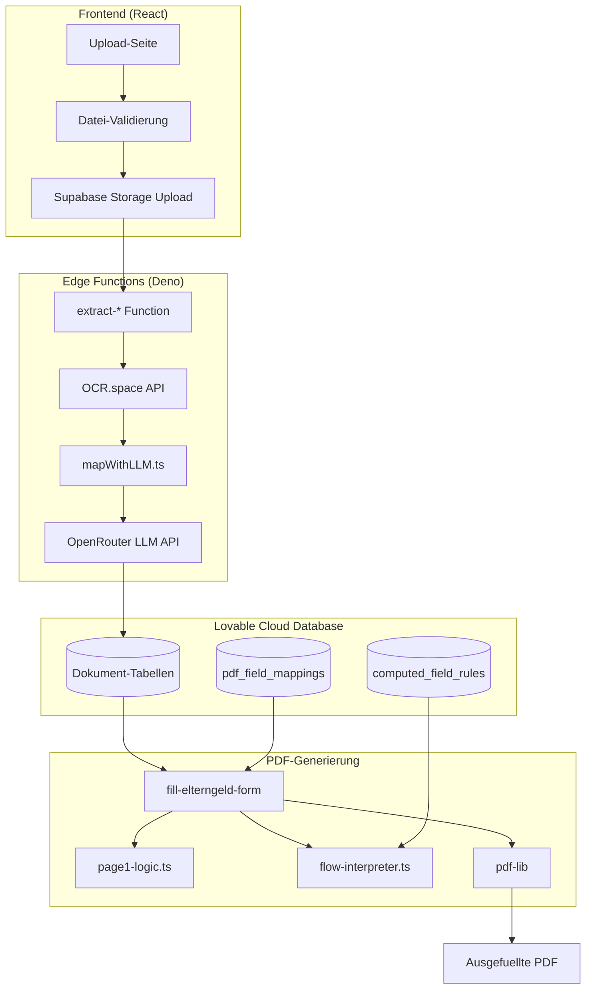
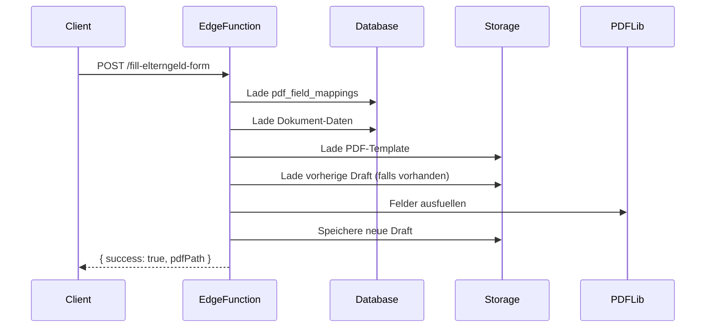

# OCR-zu-PDF Workflow - Technische Dokumentation

> Vollstaendige Dokumentation des Datenflusses von Dokument-Upload ueber OCR-Extraktion bis zur ausgefuellten Elterngeld-PDF.

---

## Inhaltsverzeichnis

1. [Architektur-Uebersicht](#architektur-uebersicht)
2. [Phase 1: Dokument-Upload](#phase-1-dokument-upload)
3. [Phase 2: OCR-Verarbeitung](#phase-2-ocr-verarbeitung)
4. [Phase 3: LLM-Datenextraktion](#phase-3-llm-datenextraktion)
5. [Phase 4: Datenbank-Speicherung](#phase-4-datenbank-speicherung)
6. [Phase 5: PDF-Feldmapping](#phase-5-pdf-feldmapping)
7. [Phase 6: Business-Logik](#phase-6-business-logik)
8. [Phase 7: PDF-Generierung](#phase-7-pdf-generierung)
9. [Beispiele](#beispiele)
10. [Troubleshooting](#troubleshooting)

---

## Architektur-Uebersicht



### Komponenten-Uebersicht

| Komponente | Technologie | Zweck |
|------------|-------------|-------|
| Frontend | React + TypeScript | Benutzer-Interface, Datei-Upload |
| Storage | Supabase Storage | Sichere Dateispeicherung |
| OCR | OCR.space API | Texterkennung aus PDF/Bildern |
| LLM | OpenRouter API | Strukturierte Datenextraktion |
| Database | PostgreSQL | Persistente Datenspeicherung |
| PDF-Lib | pdf-lib | PDF-Formular ausfuellen |

---

## Phase 1: Dokument-Upload

### Beteiligte Dateien

```
src/pages/Upload*.tsx              # 16 Upload-Seiten
src/lib/file-validation.ts         # Client-seitige Validierung
src/components/documents/DocumentUploader.tsx
```

### Unterstuetzte Formate

| Format | MIME-Type | Max. Groesse |
|--------|-----------|--------------|
| PDF | `application/pdf` | 10 MB |
| JPEG | `image/jpeg` | 10 MB |
| PNG | `image/png` | 10 MB |

### Validierungs-Logik

```typescript
// src/lib/file-validation.ts
export const ALLOWED_MIME_TYPES = [
  'application/pdf',
  'image/jpeg',
  'image/png',
  'image/jpg'
] as const;

export const MAX_FILE_SIZE = 10 * 1024 * 1024; // 10 MB
export const MAX_FILENAME_LENGTH = 100;

export function validateFile(file: File): FileValidationResult {
  // 1. Pruefe MIME-Type
  const typeResult = validateFileType(file);
  if (!typeResult.valid) return typeResult;
  
  // 2. Pruefe Dateigroesse
  const sizeResult = validateFileSize(file);
  if (!sizeResult.valid) return sizeResult;
  
  // 3. Pruefe Dateiendung
  return validateFileExtension(file.name);
}
```

### Dateiname-Sanitization

```typescript
export function sanitizeFilename(filename: string): string {
  // Entferne gefaehrliche Zeichen
  let sanitized = filename.replace(/[^a-zA-Z0-9._-]/g, '_');
  // Entferne mehrfache Unterstriche
  sanitized = sanitized.replace(/_+/g, '_');
  // Begrenze Laenge
  if (sanitized.length > MAX_FILENAME_LENGTH) {
    const ext = sanitized.split('.').pop() || '';
    sanitized = sanitized.slice(0, MAX_FILENAME_LENGTH - ext.length - 1) + '.' + ext;
  }
  return sanitized;
}
```

### Upload-Prozess (Beispiel: Geburtsurkunde)

```typescript
// src/pages/UploadGeburtsurkunde.tsx
const handleUpload = async (file: File) => {
  // 1. Validierung
  const validation = validateFile(file);
  if (!validation.valid) {
    toast.error(validation.error);
    return;
  }
  
  // 2. Storage Upload
  const filePath = createSecureFilePath(userId, file.name);
  const { error: uploadError } = await supabase.storage
    .from('documents')
    .upload(filePath, file);
  
  // 3. Edge Function aufrufen
  const { data, error } = await supabase.functions.invoke(
    'extract-geburtsurkunde',
    {
      body: {
        filePath,
        kindTyp: 'primaer' // oder 'geschwister'
      }
    }
  );
};
```

---

## Phase 2: OCR-Verarbeitung

### Beteiligte Dateien

```
supabase/functions/extract-*/index.ts     # 16 Extraktoren
supabase/functions/_shared/file-validation.ts
```

### OCR.space API Konfiguration

```typescript
// Gemeinsame OCR-Konfiguration in allen extract-* Functions
const ocrFormData = new FormData();
ocrFormData.append('base64Image', `data:${contentType};base64,${base64Data}`);
ocrFormData.append('language', 'ger');           // Deutsche Sprache
ocrFormData.append('isOverlayRequired', 'false');
ocrFormData.append('OCREngine', '2');            // Engine 2 fuer bessere Genauigkeit
ocrFormData.append('scale', 'true');
ocrFormData.append('detectOrientation', 'true');

const ocrResponse = await fetch('https://api.ocr.space/parse/image', {
  method: 'POST',
  headers: {
    'apikey': Deno.env.get('OCR_SPACE_API_KEY')!,
  },
  body: ocrFormData,
});
```

### OCR-Engines Vergleich

| Engine | Geschwindigkeit | Genauigkeit | Empfehlung |
|--------|-----------------|-------------|------------|
| Engine 1 | Schnell | Gut | Standard-Dokumente |
| Engine 2 | Langsamer | Sehr gut | Komplexe Layouts, Handschrift |

### Fehlerbehandlung

```typescript
if (!ocrResult.ParsedResults || ocrResult.ParsedResults.length === 0) {
  throw new Error('OCR lieferte keine Ergebnisse');
}

const extractedText = ocrResult.ParsedResults[0].ParsedText;
if (!extractedText || extractedText.trim().length === 0) {
  throw new Error('Kein Text im Dokument erkannt');
}
```

---

## Phase 3: LLM-Datenextraktion

### Beteiligte Dateien

```
supabase/functions/extract-*/mapWithLLM.ts
supabase/functions/_shared/llm-config.ts
```

### LLM-Konfiguration

```typescript
// supabase/functions/_shared/llm-config.ts
export const LLM_CONFIG = {
  model: "google/gemini-2.0-flash-exp:free",
  maxRetries: 4,
  baseDelayMs: 1000,
  temperature: 0.1,
  apiEndpoint: "https://openrouter.ai/api/v1/chat/completions",
};

export function getRetryDelay(attempt: number): number {
  return LLM_CONFIG.baseDelayMs * Math.pow(2, attempt - 1);
  // Attempt 1: 1000ms, Attempt 2: 2000ms, Attempt 3: 4000ms, Attempt 4: 8000ms
}
```

### Schema-Definition (Beispiel: Geburtsurkunde)

```typescript
// supabase/functions/extract-geburtsurkunde/mapWithLLM.ts
const TABLE_SCHEMA = `
CREATE TABLE geburtsurkunden (
  id UUID PRIMARY KEY,
  kind_vorname TEXT,           -- Vorname des Kindes
  kind_nachname TEXT,          -- Nachname des Kindes
  kind_geburtsdatum TEXT,      -- Format: YYYY-MM-DD
  kind_geburtsort TEXT,        -- Geburtsort
  kind_geburtsnummer TEXT,     -- Geburtsnummer/Registernummer
  mutter_vorname TEXT,
  mutter_nachname TEXT,
  mutter_geburtsname TEXT,     -- Geburtsname der Mutter
  vater_vorname TEXT,
  vater_nachname TEXT,
  behoerde_name TEXT,          -- Ausstellende Behoerde
  ausstelldatum TEXT,          -- Format: YYYY-MM-DD
  urkundennummer TEXT,
  confidence_scores JSONB      -- Pro Feld: 0.0 - 1.0
);
`;
```

### System-Prompt Struktur

```typescript
const systemPrompt = `Du bist ein Experte fuer die Extraktion von Daten aus deutschen Geburtsurkunden.

AUFGABE:
Extrahiere alle relevanten Daten aus dem OCR-Text und gib sie als JSON zurueck.

SCHEMA:
${TABLE_SCHEMA}

WICHTIGE REGELN:
1. Datumsformat: IMMER YYYY-MM-DD (z.B. 2024-03-15)
2. Leere Felder: null (nicht "" oder "N/A")
3. Confidence-Scores: 
   - 0.9-1.0: Klar lesbar, eindeutig
   - 0.7-0.9: Lesbar mit kleinen Unsicherheiten
   - 0.5-0.7: Teilweise erkennbar
   - <0.5: Nicht sicher erkannt

ANTWORTFORMAT:
{
  "kind_vorname": "Max",
  "kind_nachname": "Mustermann",
  ...
  "confidence_scores": {
    "kind_vorname": 0.95,
    "kind_nachname": 0.92
  }
}`;
```

### API-Aufruf mit Retry-Logik

```typescript
export async function mapWithLLM(ocrText: string): Promise<ExtractedData> {
  const apiKey = Deno.env.get('OPENROUTER_API_KEY');
  
  for (let attempt = 1; attempt <= LLM_CONFIG.maxRetries; attempt++) {
    try {
      const response = await fetch(LLM_CONFIG.apiEndpoint, {
        method: 'POST',
        headers: {
          'Authorization': `Bearer ${apiKey}`,
          'Content-Type': 'application/json',
          'HTTP-Referer': 'https://elterngeld-app.lovable.app',
        },
        body: JSON.stringify({
          model: LLM_CONFIG.model,
          temperature: LLM_CONFIG.temperature,
          messages: [
            { role: 'system', content: systemPrompt },
            { role: 'user', content: `OCR-TEXT:\n${ocrText}` }
          ]
        })
      });
      
      if (response.status === 429) {
        // Rate Limit - warten und erneut versuchen
        const delay = getRetryDelay(attempt);
        await new Promise(r => setTimeout(r, delay));
        continue;
      }
      
      if (!response.ok) {
        throw new Error(`API error: ${response.status}`);
      }
      
      const result = await response.json();
      return JSON.parse(result.choices[0].message.content);
      
    } catch (error) {
      if (attempt === LLM_CONFIG.maxRetries) throw error;
      await new Promise(r => setTimeout(r, getRetryDelay(attempt)));
    }
  }
}
```

---

## Phase 4: Datenbank-Speicherung

### Dokument-Tabellen

| Tabelle | Zweck | Wichtige Felder |
|---------|-------|-----------------|
| `geburtsurkunden` | Kinder-Geburtsurkunden | kind_vorname, kind_geburtsdatum |
| `eltern_dokumente` | Ausweise der Eltern | vorname, nachname, geburtsdatum, person_type |
| `gehaltsnachweise` | Lohnabrechnungen | bruttogehalt, nettogehalt, abrechnungsmonat |
| `arbeitgeberbescheinigungen` | AG-Bescheinigungen | elternzeit_von/bis, mutterschutz_beginn |
| `mutterschaftsgeld` | Mutterschaftsgeld-Bescheide | tagessatz, leistungsbeginn |
| `einkommensteuerbescheide` | Steuerbescheide | zu_versteuerndes_einkommen |
| `bankverbindungen` | Bankdaten | iban, bic, kontoinhaber |
| `schwerbehindertenausweise` | SB-Ausweise | grad_der_behinderung, merkzeichen_* |

### Person-Type Enum

```sql
CREATE TYPE person_type_enum AS ENUM ('eltern1', 'eltern2');
```

- `eltern1` = Vater (ohne Suffix im PDF: `txt.vorname1A`)
- `eltern2` = Mutter (mit Suffix `_1` im PDF: `txt.vorname1A_1`)

### Speicher-Prozess

```typescript
// Beispiel: Geburtsurkunde speichern
const { data, error } = await supabase
  .from('geburtsurkunden')
  .upsert({
    user_id: userId,
    kind_vorname: extractedData.kind_vorname,
    kind_nachname: extractedData.kind_nachname,
    kind_geburtsdatum: extractedData.kind_geburtsdatum,
    // ... weitere Felder
    confidence_scores: extractedData.confidence_scores,
    file_path: filePath,
    updated_at: new Date().toISOString()
  })
  .select()
  .single();
```

### RLS-Policies

```sql
-- Nutzer sehen nur eigene Dokumente
CREATE POLICY "Users can view own documents"
ON geburtsurkunden FOR SELECT
USING (auth.uid() = user_id);

-- Nutzer koennen eigene Dokumente erstellen
CREATE POLICY "Users can insert own documents"
ON geburtsurkunden FOR INSERT
WITH CHECK (auth.uid() = user_id);

-- Nutzer koennen eigene Dokumente aktualisieren
CREATE POLICY "Users can update own documents"
ON geburtsurkunden FOR UPDATE
USING (auth.uid() = user_id);
```

---

## Phase 5: PDF-Feldmapping

### Beteiligte Dateien

```
supabase/functions/fill-elterngeld-form/index.ts
Datenbank-Tabelle: pdf_field_mappings
```

### Mapping-Struktur

```sql
CREATE TABLE pdf_field_mappings (
  id UUID PRIMARY KEY,
  document_type TEXT,           -- 'elterngeldantrag'
  pdf_field_name TEXT,          -- z.B. 'txt.vorname1A 4'
  source_table TEXT,            -- z.B. 'geburtsurkunden'
  source_field TEXT,            -- z.B. 'kind_vorname'
  filter_condition JSONB,       -- z.B. {"kind_ordnungszahl": 0}
  format_hint TEXT,             -- z.B. 'date:DD.MM.YYYY'
  page_number INTEGER,
  is_active BOOLEAN DEFAULT true
);
```

### Beispiel-Mappings

| PDF-Feld | Quelle | Filter | Beschreibung |
|----------|--------|--------|--------------|
| `txt.vorname1A 4` | geburtsurkunden.kind_vorname | kind_ordnungszahl=0 | Vorname 1. Kind |
| `txt.vorname1A 5` | geburtsurkunden.kind_vorname | kind_ordnungszahl=1 | Vorname 2. Kind |
| `txt.vorname1A` | eltern_dokumente.vorname | person_type='eltern1' | Vorname Vater |
| `txt.vorname1A_1` | eltern_dokumente.vorname | person_type='eltern2' | Vorname Mutter |

### Filter-Bedingungen

```typescript
interface FilterCondition {
  person_type?: 'eltern1' | 'eltern2';
  kind_ordnungszahl?: number;    // 0 = erstes Kind, 1 = zweites Kind
  kind_typ?: 'primaer' | 'geschwister';
}

// Anwendung des Filters
function applyFilter(data: any[], filter: FilterCondition): any {
  return data.find(item => {
    if (filter.person_type && item.person_type !== filter.person_type) return false;
    if (filter.kind_ordnungszahl !== undefined && 
        item.kind_ordnungszahl !== filter.kind_ordnungszahl) return false;
    return true;
  });
}
```

### Datumsformatierung

```typescript
function formatDateForPDF(isoDate: string): string {
  if (!isoDate) return '';
  // Input: 2024-03-15
  // Output: 15.03.2024
  const [year, month, day] = isoDate.split('-');
  return `${day}.${month}.${year}`;
}
```

### Checkbox-Behandlung

```typescript
function formatValueForPDF(value: any, fieldType: string): string {
  if (value === null || value === undefined) return '';
  
  // Boolean zu "X" fuer Checkboxen
  if (typeof value === 'boolean') {
    return value ? 'X' : '';
  }
  
  // Datum formatieren
  if (fieldType === 'date' && typeof value === 'string') {
    return formatDateForPDF(value);
  }
  
  return String(value);
}
```

---

## Phase 6: Business-Logik

### Beteiligte Dateien

```
supabase/functions/fill-elterngeld-form/page1-logic.ts
supabase/functions/fill-elterngeld-form/flow-interpreter.ts
Datenbank-Tabelle: computed_field_rules
```

### Mehrlinge-Erkennung

```typescript
// page1-logic.ts
function countMehrlinge(geburtsurkunden: Geburtsurkunde[]): number {
  const primaerKind = geburtsurkunden.find(g => g.kind_typ === 'primaer');
  if (!primaerKind) return 0;
  
  // Mehrlinge = gleicher Geburtstag, anderer Name
  return geburtsurkunden.filter(g => 
    g.kind_geburtsdatum === primaerKind.kind_geburtsdatum &&
    g.kind_vorname !== primaerKind.kind_vorname
  ).length;
}

// Checkbox-Logik
if (mehrlingeCount > 0) {
  fieldValues['chk.mehrling'] = true;
  fieldValues['txt.mehrling_anzahl'] = String(mehrlingeCount + 1);
}
```

### Fruehgeburt-Pruefung

```typescript
function isFruehgeburt(
  tatsaechlichesGeburtsdatum: string,
  errechneterTermin: string
): boolean {
  const geburt = new Date(tatsaechlichesGeburtsdatum);
  const termin = new Date(errechneterTermin);
  
  // Differenz in Tagen
  const diffDays = (termin.getTime() - geburt.getTime()) / (1000 * 60 * 60 * 24);
  
  // Fruehgeburt = mehr als 6 Wochen (42 Tage) vor Termin
  return diffDays > 42;
}
```

### Geschwister-Zaehlung

```typescript
function countGeschwister(geburtsurkunden: Geburtsurkunde[]): {
  unter3: number;
  unter6: number;
  mitBehinderung: number;
} {
  const heute = new Date();
  const primaerKind = geburtsurkunden.find(g => g.kind_typ === 'primaer');
  const geschwister = geburtsurkunden.filter(g => g.kind_typ === 'geschwister');
  
  return {
    unter3: geschwister.filter(g => {
      const geburt = new Date(g.kind_geburtsdatum);
      const alter = (heute.getTime() - geburt.getTime()) / (1000 * 60 * 60 * 24 * 365);
      return alter < 3;
    }).length,
    unter6: geschwister.filter(g => {
      const alter = calculateAge(g.kind_geburtsdatum);
      return alter >= 3 && alter < 6;
    }).length,
    mitBehinderung: geschwister.filter(g => 
      g.schwerbehindert === true || g.grad_der_behinderung >= 50
    ).length
  };
}
```

### Visual Logic Designer (computed_field_rules)

```typescript
// flow-interpreter.ts
interface FlowDefinition {
  nodes: FlowNode[];
  edges: FlowEdge[];
}

interface FlowNode {
  id: string;
  type: 'dataSource' | 'condition' | 'setField' | 'loop' | 'aggregate';
  data: Record<string, any>;
}

// Beispiel: Regel zur Geschwisterbonus-Berechnung
const geschwisterBonusFlow: FlowDefinition = {
  nodes: [
    { id: '1', type: 'dataSource', data: { table: 'geburtsurkunden' } },
    { id: '2', type: 'condition', data: { 
      field: 'kind_typ', 
      operator: 'equals', 
      value: 'geschwister' 
    }},
    { id: '3', type: 'aggregate', data: { operation: 'count' } },
    { id: '4', type: 'condition', data: { 
      field: 'count', 
      operator: 'greaterThan', 
      value: 0 
    }},
    { id: '5', type: 'setField', data: { 
      pdfField: 'chk.geschwisterbonus', 
      value: true 
    }}
  ],
  edges: [
    { source: '1', target: '2' },
    { source: '2', target: '3' },
    { source: '3', target: '4' },
    { source: '4', target: '5' }
  ]
};
```

---

## Phase 7: PDF-Generierung

### Beteiligte Dateien

```
supabase/functions/fill-elterngeld-form/index.ts
Bibliothek: pdf-lib
Storage Buckets: form-templates, elterngeldantrag-drafts
```

### Prozess-Uebersicht



### PDF-Template laden

```typescript
import { PDFDocument } from 'https://cdn.skypack.dev/pdf-lib@1.17.1?dts';

async function loadPdfTemplate(supabase: SupabaseClient): Promise<PDFDocument> {
  // 1. Versuche vorherige Draft zu laden
  const { data: existingDraft } = await supabase.storage
    .from('elterngeldantrag-drafts')
    .download(`${userId}/current-draft.pdf`);
  
  if (existingDraft) {
    const bytes = await existingDraft.arrayBuffer();
    return PDFDocument.load(bytes);
  }
  
  // 2. Sonst: Lade leeres Template
  const { data: template } = await supabase.storage
    .from('form-templates')
    .download('elterngeldantrag_bis_Maerz25.pdf');
  
  const bytes = await template.arrayBuffer();
  return PDFDocument.load(bytes);
}
```

### Felder ausfuellen

```typescript
async function fillPdfFields(
  pdfDoc: PDFDocument,
  fieldValues: Record<string, string>
): Promise<void> {
  const form = pdfDoc.getForm();
  
  for (const [fieldName, value] of Object.entries(fieldValues)) {
    if (!value) continue; // Leere Werte ueberspringen
    
    try {
      // Versuche als Textfeld
      const textField = form.getTextField(fieldName);
      textField.setText(value);
    } catch {
      try {
        // Versuche als Checkbox
        const checkbox = form.getCheckBox(fieldName);
        if (value === 'X' || value === 'true') {
          checkbox.check();
        }
      } catch {
        console.warn(`Feld nicht gefunden: ${fieldName}`);
      }
    }
  }
}
```

### Wert-Sanitization

```typescript
function sanitizeFieldValues(
  values: Record<string, any>
): Record<string, string> {
  const sanitized: Record<string, string> = {};
  
  for (const [key, value] of Object.entries(values)) {
    // Null/undefined/leere Strings ueberspringen
    if (value === null || value === undefined || value === '') continue;
    
    // Boolean zu "X" konvertieren
    if (value === true) {
      sanitized[key] = 'X';
    } else if (value === false) {
      // false nicht ins PDF schreiben
      continue;
    } else {
      sanitized[key] = String(value);
    }
  }
  
  return sanitized;
}
```

### PDF speichern

```typescript
async function savePdf(
  supabase: SupabaseClient,
  pdfDoc: PDFDocument,
  userId: string
): Promise<string> {
  const pdfBytes = await pdfDoc.save();
  const filePath = `${userId}/current-draft.pdf`;
  
  const { error } = await supabase.storage
    .from('elterngeldantrag-drafts')
    .upload(filePath, pdfBytes, {
      contentType: 'application/pdf',
      upsert: true
    });
  
  if (error) throw error;
  return filePath;
}
```

---

## Beispiele

### Beispiel 1: Vollstaendiger Geburtsurkunden-Flow

```typescript
// 1. Frontend: Upload starten
const { data, error } = await supabase.functions.invoke('extract-geburtsurkunde', {
  body: { 
    filePath: 'user123/1706789012_geburtsurkunde.pdf',
    kindTyp: 'primaer'
  }
});

// 2. Edge Function: OCR durchfuehren
const ocrText = await performOCR(fileBytes);
// Ergebnis: "GEBURTSURKUNDE\nMax Mustermann\ngeb. 15. Maerz 2024\nin Berlin..."

// 3. Edge Function: LLM-Extraktion
const extracted = await mapWithLLM(ocrText);
// Ergebnis:
{
  kind_vorname: "Max",
  kind_nachname: "Mustermann",
  kind_geburtsdatum: "2024-03-15",
  kind_geburtsort: "Berlin",
  confidence_scores: {
    kind_vorname: 0.95,
    kind_nachname: 0.98,
    kind_geburtsdatum: 0.92
  }
}

// 4. Datenbank: Speichern
await supabase.from('geburtsurkunden').insert({
  user_id: 'user123',
  ...extracted,
  kind_typ: 'primaer',
  kind_ordnungszahl: 0
});

// 5. PDF fuellen (spaeter im Wizard)
const mapping = { 
  'txt.vorname1A 4': 'Max',
  'txt.nachname1A 4': 'Mustermann',
  'txt.geb_datum1a 4': '15.03.2024'
};
await fillPdfFields(pdfDoc, mapping);
```

### Beispiel 2: Mehrlinge-Behandlung

```typescript
// Zwei Kinder mit gleichem Geburtsdatum = Zwillinge
const geburtsurkunden = [
  { kind_vorname: 'Max', kind_geburtsdatum: '2024-03-15', kind_typ: 'primaer' },
  { kind_vorname: 'Mia', kind_geburtsdatum: '2024-03-15', kind_typ: 'primaer' }
];

const mehrlingeCount = countMehrlinge(geburtsurkunden); // = 1

// Checkbox setzen
fieldValues['chk.mehrling'] = true;
fieldValues['txt.mehrling_anzahl'] = '2'; // Gesamtzahl der Mehrlinge
```

### Beispiel 3: Geschwisterbonus

```typescript
// Geschwister unter 3 Jahren
const geschwister = [
  { kind_vorname: 'Emma', kind_geburtsdatum: '2022-06-01', kind_typ: 'geschwister' }
];

const { unter3, unter6 } = countGeschwister(geschwister);
// unter3 = 1, unter6 = 0

// Checkbox-Logik
if (unter3 >= 1 || unter6 >= 2) {
  fieldValues['chk.geschwisterbonus'] = true;
}
```

---

## Troubleshooting

Siehe [Troubleshooting-Guide](./troubleshooting.md) fuer detaillierte Fehlerbehebung.

### Schnellreferenz

| Problem | Ursache | Loesung |
|---------|---------|---------|
| API error: 404 | LLM-Modell nicht verfuegbar | `llm-config.ts` Modell aendern |
| Kein OCR-Text | Bildqualitaet, Dateiformat | Besseren Scan verwenden |
| Feld nicht im PDF | Falscher Feldname | Gross-/Kleinschreibung pruefen |
| Checkbox leer | Boolean als String | `value === true` pruefen |
| Datum falsch | ISO vs. DE-Format | `formatDateForPDF()` verwenden |

---

## Weitere Dokumentation

- [Workflow-Diagramme](./diagrams/workflow-overview.md)
- [Troubleshooting-Guide](./troubleshooting.md)
- [API-Referenz](./api-reference.md)
