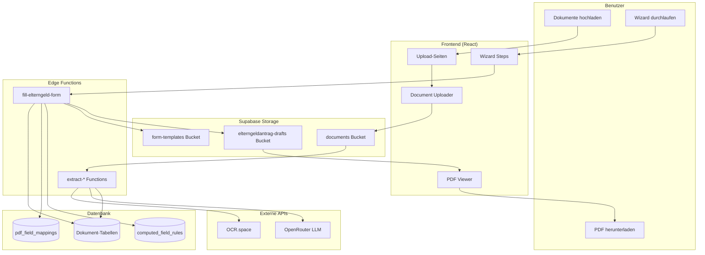
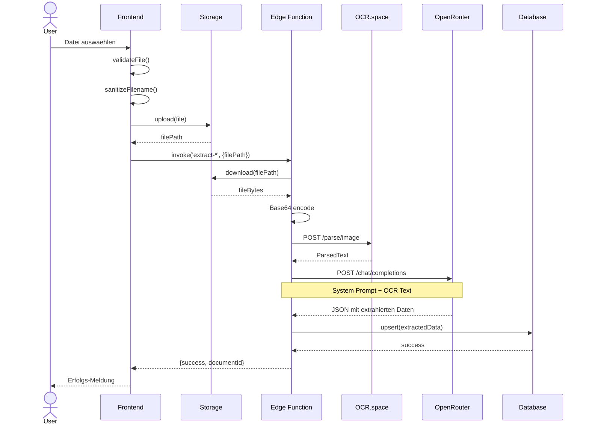
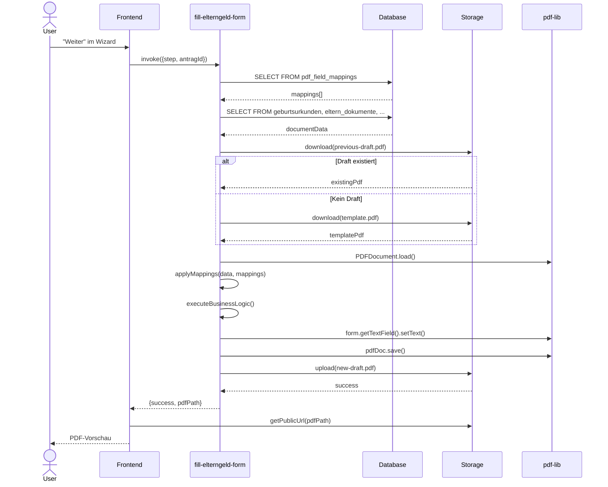
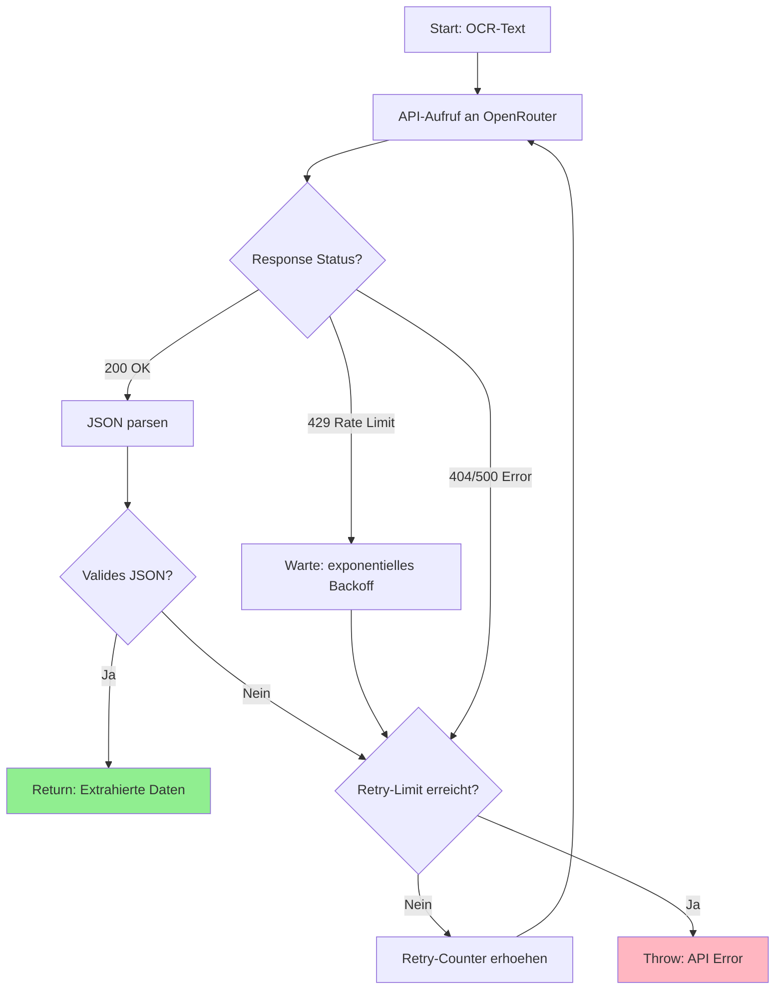
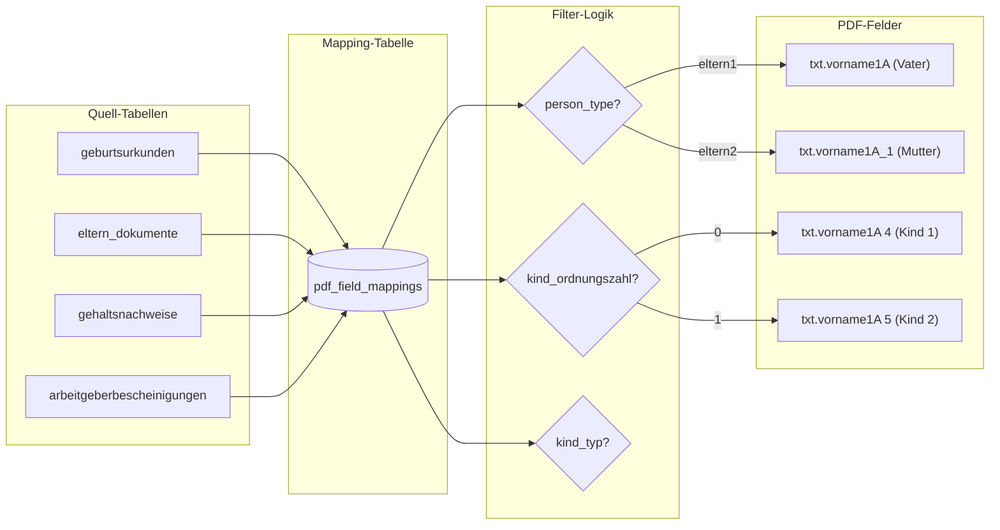
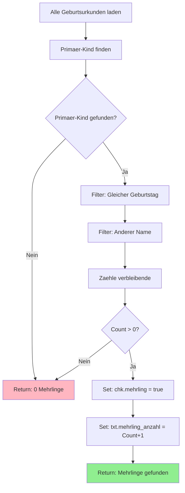
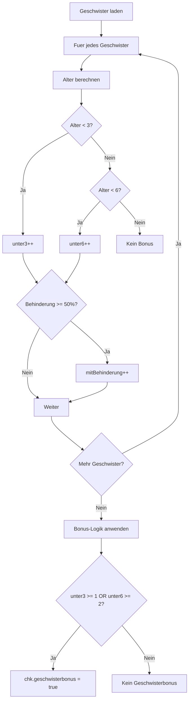
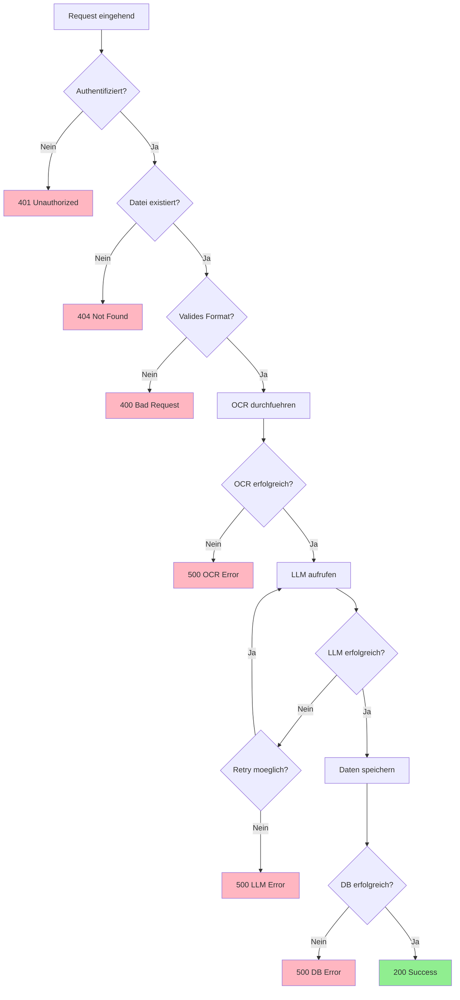

# Workflow-Diagramme

## Gesamt-Architektur

---

## Dokument-Upload Flow

---

## PDF-Generierung Flow

---

## LLM-Extraktion mit Retry

---

## Daten-Mapping Logik

---

## Business-Logik: Mehrlinge

---

## Business-Logik: Geschwisterbonus

---

## Fehlerbehandlung

